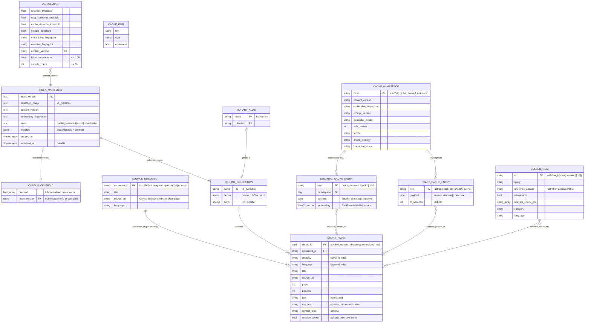

# FastRAG data model (ERD)

Companion to the interactive entity map in [`data-model.html`](data-model.html). Attributes and
cardinalities are taken from the code at commit `41815d0`; the source for each entity is listed
below the diagram.

Only `index_manifests` is a relational table. The Qdrant, Redis and file entities are documents
or keys, and **every relationship is logical**: no store enforces a foreign key, so the code keeps
them consistent.

## Rules the diagram cannot show

- **At most one `active` row.** A partial unique index, `one_active_index`, enforces this.
  `activate()` retires the current active row and promotes a `validated` one inside the same
  connection.
- **A collection is recreated if its name exists.** A build that reuses an index version drops
  and recreates `kb_{version}`, and re-registering that version resets its row to `building`.
- **Uploads share the live collection.** Session uploads are chunk points written into the
  active collection with `session_upload = true`. Unscoped searches exclude them, and they have
  no TTL.
- **Cache entries scope themselves.** Namespace inputs include `content_version`, so a new
  index makes earlier entries unreachable rather than deleting them. They expire after 7 days.
- **Calibration is pinned to the index.** It is fitted against one `content_version`, and
  startup fails readiness when the active index differs.

## Sources

| Entity | Code |
|---|---|
| `index_manifests` | `src/fastrag/registry.py:15-59`, `:95-109` |
| Qdrant collection and alias | `src/fastrag/indexing.py:109-111`, `:187-212`, `:290-304`; `src/fastrag/config.py:43` |
| Chunk point | `src/fastrag/chunking.py:328-367`; `src/fastrag/indexing.py:224-237`; `src/fastrag/ingest_document.py:103-104` |
| Source document | `src/fastrag/chunking.py:34-42`; `scripts/selfcorpus/sources.py:147-158`; `src/fastrag/ingest_document.py:71` |
| Calibration | `src/fastrag/calibration.py:12-80`; `src/fastrag/calibrate.py:184-200` |
| Corpus centroid | `src/fastrag/registry.py:194-213`; `src/fastrag/indexing.py:266-280` |
| Cache namespace and entries | `src/fastrag/fingerprint.py:26-50`; `src/fastrag/adapters/cache.py:53-215` |
| Golden item and cache pair | `scripts/selfcorpus/golden.py:105-124`, `:446-484`; `src/fastrag/evaluation.py:19-34` |
